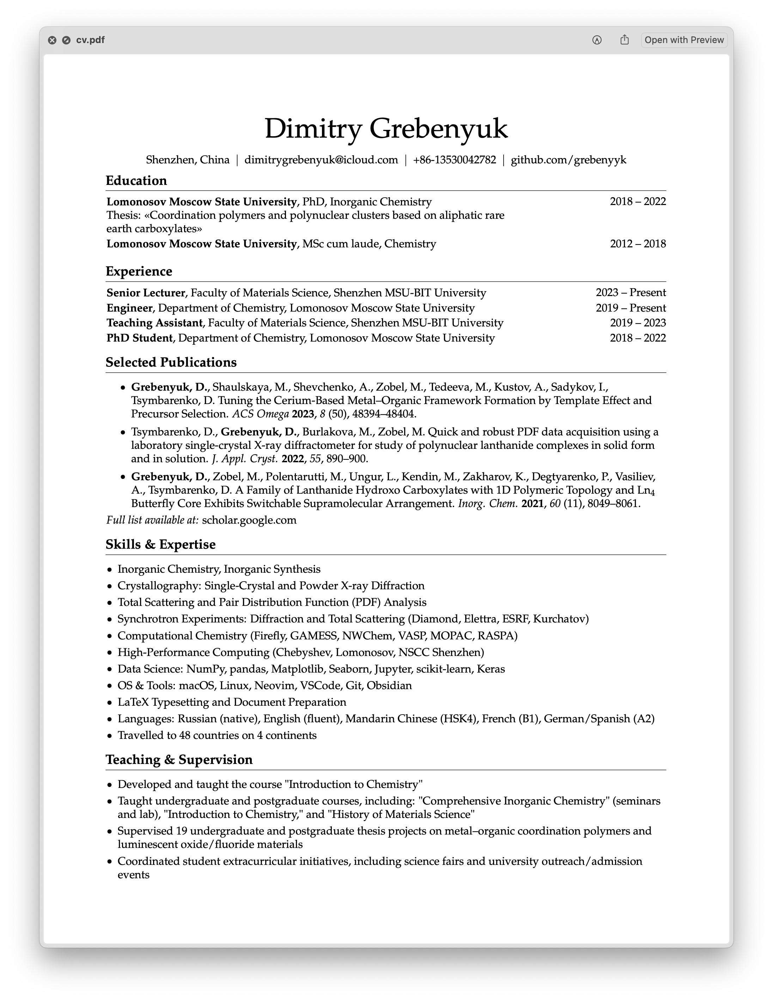

# LaTeX Typesetting Portfolio

This repository showcases my LaTeX typesetting work across multiple formats:
- Academic articles and reports
- CV
- Lecture slides and presentations
- Posters and infographics
- Books and educational material

## Highlights

- **Chemistry Textbook:** Russian-language educational material with glossary columns (Russian-English-Chinese).
- **Beamer Presentation:** Conference slides for inorganic chemistry talk.
- **Scientific Posters:** Designed with TikZ and custom templates.

Each subfolder contains both the source `.tex` files and the compiled `.pdf` documents.

## Introduction to Chemistry course, example homework assignment

## One-Page Academic CV

