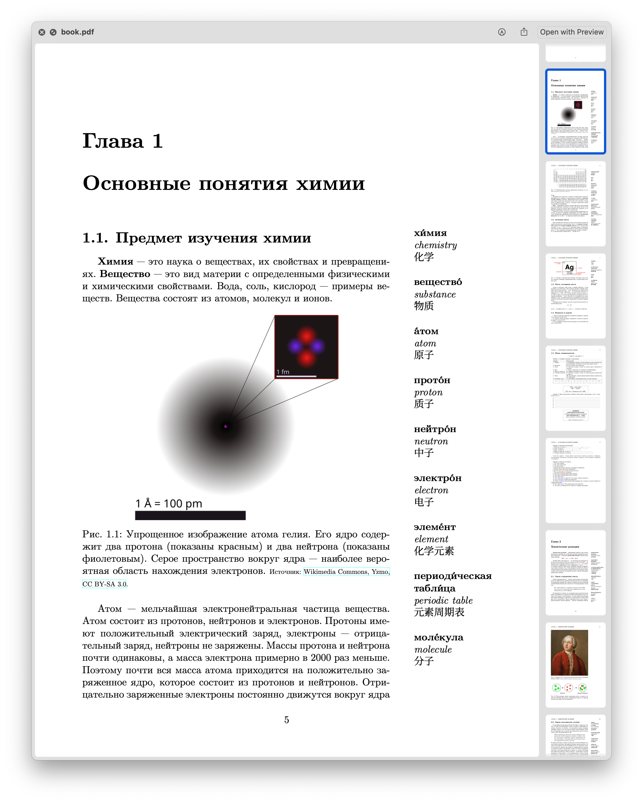

# LaTeX Typesetting Portfolio

This repository showcases my LaTeX typesetting work across multiple formats:
- CV
- Books and educational material
- Academic articles and reports
- Lecture slides and presentations
- Posters and infographics

Each subfolder contains both the source `.tex` files and the compiled `.pdf` documents.

## One-Page Academic CV

## Tri-lingual Introduction to Chemistry textbook

## Introduction to Chemistry course, example homework assignment
